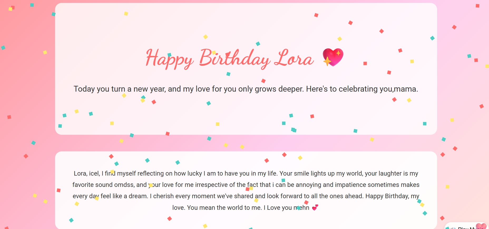

#  Birthday Website

A modern and responsive birthday celebration website built with HTML, CSS, and JavaScript. It provides an engaging experience with beautiful visuals and interactive elements.

---

##  Live Demo
https://comfy-dasik-e9a6adhdtull.netlify.app/

---

##  Screenshot

---

##  Features

- Responsive design
- Beautiful landing page
- Interactive animations
- Mobile-friendly layout
- Modern user interface

---

## Technologies Used

- HTML5
- CSS3
- JavaScript

---

##  How to Run

1. Clone the repository.
2. Open the project folder.
3. Open `index.html` in your browser.

---

##  Author

**Isaac Zachariah**

GitHub: https://github.com/isaacbuildsgood
